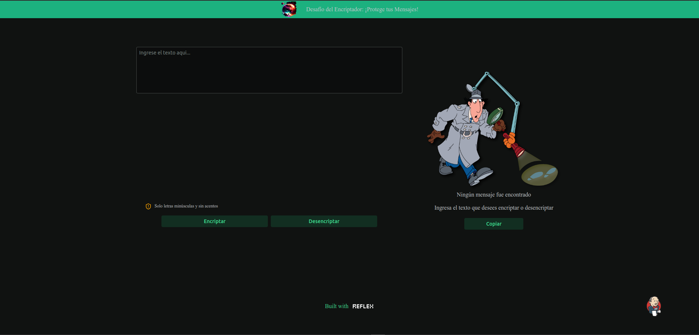
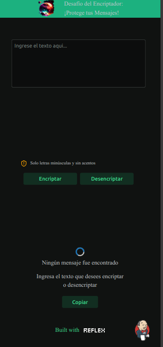
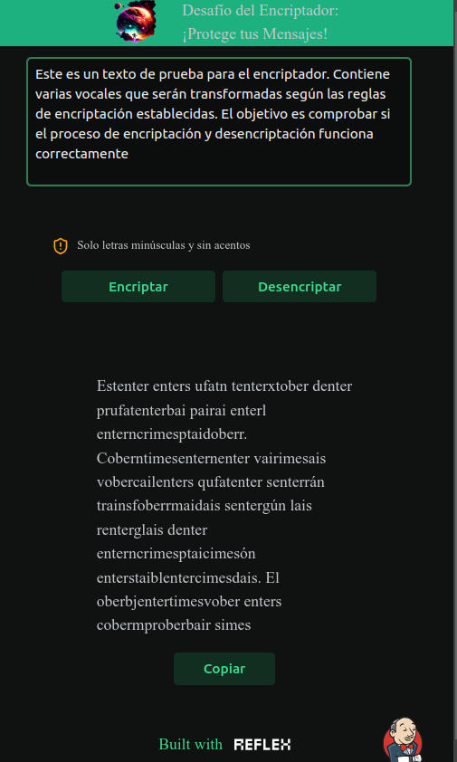

<h1># Encriptador de Textos</h1>

<h2>¡Bienvenidos y Bienvenidas a nuestro primer desafío!</h2>

Esta aplicación web permite encriptar y desencriptar textos para intercambiar mensajes secretos utilizando una técnica de encriptación simple en python.

## Descripción

La aplicación transforma cada vocal en un conjunto de letras según las siguientes reglas:
- La letra "e" se convierte en "enter"
- La letra "i" se convierte en "imes"
- La letra "a" se convierte en "ai"
- La letra "o" se convierte en "ober"
- La letra "u" se convierte en "ufat"

Por ejemplo:
- "gato" se convierte en "gaitober"
- "gaitober" se convierte en "gato"

## Requisitos

1. Solo debe funcionar con letras minúsculas.
2. No deben ser utilizadas letras con acentos ni caracteres especiales.
3. Debe ser posible convertir una palabra a su versión encriptada y devolver una palabra encriptada a su versión original.

## Funcionalidades

- Campo de entrada de texto para encriptar y desencriptar.
- Botones para elegir entre encriptar y desencriptar.
- El resultado se muestra en la pantalla.

## Instalación

1. Clona el repositorio:
    ```bash
    git clone https://github.com/tu-usuario/encriptador.git
    ```
2. Navega al directorio del proyecto:
    ```bash
    cd encriptador
    ```
3. Abre el archivo `index.html` en tu navegador.

## Uso

1. Ingresa el texto que deseas encriptar o desencriptar en el campo de texto.
2. Selecciona la opción deseada (Encriptar o Desencriptar).
3. El resultado aparecerá en la pantalla.

## Estructura del Proyecto

- `index.html`: Contiene la estructura básica de la página web.
- `style.css`: Contiene los estilos para la página web.
- `script.js`: Contiene la lógica de encriptación y desencriptación.

## Capturas de Pantalla


<p float="left">
  
  
</p>


## Tecnologías Utilizadas

- REFLEX

## Contribuciones

Las contribuciones son bienvenidas. Por favor, sigue los pasos a continuación:

1. Haz un fork del proyecto.
2. Crea una nueva rama (`git checkout -b feature/nueva-funcionalidad`).
3. Realiza los cambios necesarios y haz commit (`git commit -m 'Agrega nueva funcionalidad'`).
4. Haz push a la rama (`git push origin feature/nueva-funcionalidad`).
5. Abre un Pull Request.

